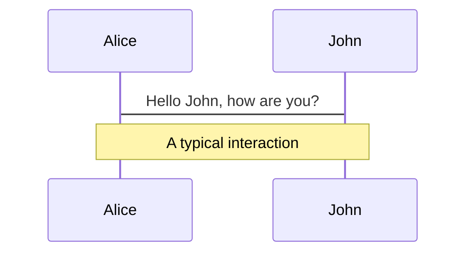
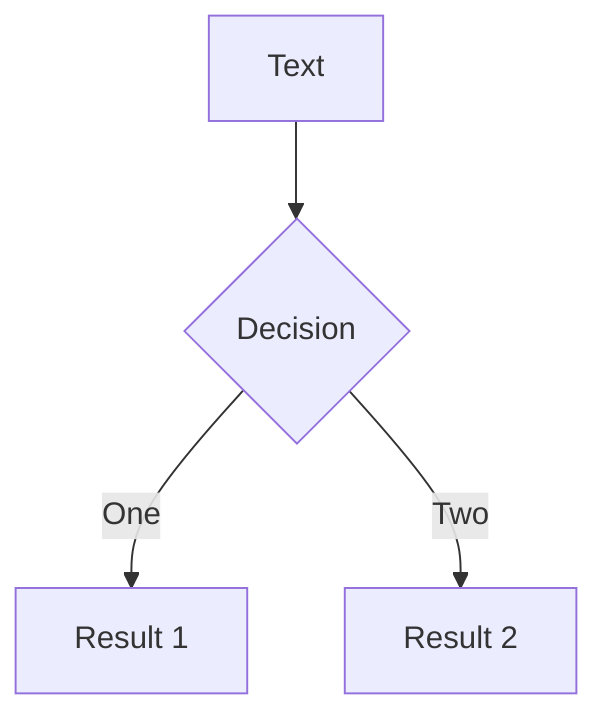
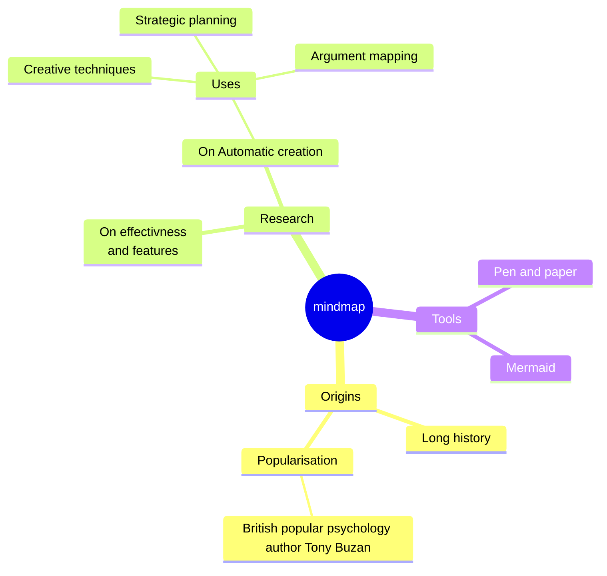
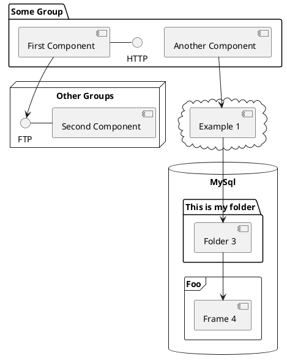

# Test con Riverpod e Mocktail

Manuale rapido per la tua business logic

---
title: Chi sono?
layout: image-right
image: https://riverpod.dev/img/logo.png
---

# Ciao!
<v-clicks>

**Chi sono?**

- 🎯 Dart enjoyer

- 🏞️ Riverpod enthusiast / supporter

- ⚗️ Functional programming lover

</v-clicks>

<v-clicks>

**Che si fa oggi?**

- 📚 Recap: cos'è Riverpod?

- 🐒 Cos'è Mocktail?

- 🧪 Scriviamo test

*bonus: Riverpod 3 spoilers!*

</v-clicks>


<div class="abs-br m-6 flex gap-2">
  <a href="https://github.com/lucavenir" target="_blank" alt="GitHub" title="~venir on GitHub"
    class="text-xl slidev-icon-btn opacity-50 !border-none !hover:text-white">
    <carbon-logo-github />
  </a>
    <a href="https://twitter.com/venir_dev" target="_blank" alt="X" title="~venir on X"
    class="text-xl slidev-icon-btn opacity-50 !border-none !hover:text-white">
    <carbon-logo-x />
  </a>
</div>

<!--
The last comment block of each slide will be treated as slide notes. It will be visible and editable in Presenter Mode along with the slide. [Read more in the docs](https://sli.dev/guide/syntax.html#notes)

You can have `style` tag in markdown to override the style for the current page.
Learn more: https://sli.dev/guide/syntax#embedded-styles
-->

---
---
# Che problema risolve Riverpod?


```dart {1|11|6|11|12-15|all}
class CheckPleaseWidget extends StatelessWidget {
  const CheckPleaseWidget({super.key});

  @override
  Widget build(BuildContext context) {
    final Future<int> bill = check();
    return Column(
      mainAxisAlignment: MainAxisAlignment.center,
      mainAxisSize: MainAxisSize.min,
      children: [
        Text('Sono € ${2 * bill}, grazie 😸'),
        ElevatedButton(
          onPressed: moreBeer,
          child: const Text('🍺'),
        ),
      ],
    );
  }
}
```

<!--
Un classico: attendiamo un risultato che in futuro, prima o poi (forse? e chi lo sa) arriverà.
Quanto vedete qui naturalmente NON va fatto, l'esempio è qui per stimolarci a volere:
- un modo per attendere il risultato e mostrare qualcosa all'utente nel frattempo
- un modo per isolare meglio la logica di business (non vogliamo il x2 nell'interfaccia!)
- un modo per gestire eventuali errori e mostrarli all'utente
- un modo per testare quanto sopra

Ah, se solo ci fosse un modo *davvero* semplice per isolare UI e Logica...
Ah, se solo potessimo iniettare, cachare e gestire dati in modo reattivo...
-->

---
---


---
---

# Business logic, with Riverpod

**Providers**: *functions with benefits*.
<br/>

<v-click>
Da ...
</v-click>
```dart {1|2|all}
Future<int> check() {
  return Future.delayed(200.milliseconds, () => 1 + 1);
}
```
<br/>
<v-click>
... a:
</v-click>

```dart {none|1|2|3|all}
@riverpod
Future<int> check(CheckRef ref) {
  return Future.delayed(200.milliseconds, () => 1 + 1);
}
```

---
---

# Business logic, with Riverpod
```dart {1-6|8-10|none}
@riverpod
class CheckController extends _$CheckController {
  @override
  Future<int> build() {
    return Future.delayed(200.milliseconds, () => 1 + 1);
  }

  Future<void> moreBeer() {
    return update((state) => Future.delayed(200.milliseconds, () => state + 1));
  }
}
```

<br/>

```dart {none|1-2|3|4}
@riverpod
Future<int> fraudCheck(FraudCheckRef ref) async {
  final check = await ref.watch(checkProvider.future);
  return 2 * check;
}
```


---
---

# Final result

Una UX... apprezzabile
```dart

```


# Code


Use code snippets and get the highlighting directly, and even types hover![^1]


```ts {all|5|7|7-8|10|all} twoslash
// TwoSlash enables TypeScript hover information
// and errors in markdown code blocks
// More at https://shiki.style/packages/twoslash

import { computed, ref } from 'vue'

const count = ref(0)
const doubled = computed(() => count.value * 2)

doubled.value = 2
```

<arrow v-click="[4, 5]" x1="350" y1="310" x2="195" y2="334" color="#953" width="2" arrowSize="1" />

<!-- This allow you to embed external code blocks -->
<<< @/snippets/first_test.dart#snippet

<!-- Footer -->
[^1]: [Learn More](https://sli.dev/guide/syntax.html#line-highlighting)

<!-- Inline style -->
<style>
.footnotes-sep {
  @apply mt-5 opacity-10;
}
.footnotes {
  @apply text-sm opacity-75;
}
.footnote-backref {
  display: none;
}
</style>

<!--
Notes can also sync with clicks

[click] This will be highlighted after the first click

[click] Highlighted with `count = ref(0)`

[click:3] Last click (skip two clicks)
-->

---
level: 2
---

# Shiki Magic Move

Powered by [shiki-magic-move](https://shiki-magic-move.netlify.app/), Slidev supports animations across multiple code snippets.

Add multiple code blocks and wrap them with <code>````md magic-move</code> (four backticks) to enable the magic move. For example:

````md magic-move
```ts {*|2|*}
// step 1
const author = reactive({
  name: 'John Doe',
  books: [
    'Vue 2 - Advanced Guide',
    'Vue 3 - Basic Guide',
    'Vue 4 - The Mystery'
  ]
})
```

```ts {*|1-2|3-4|3-4,8}
// step 2
export default {
  data() {
    return {
      author: {
        name: 'John Doe',
        books: [
          'Vue 2 - Advanced Guide',
          'Vue 3 - Basic Guide',
          'Vue 4 - The Mystery'
        ]
      }
    }
  }
}
```

```ts
// step 3
export default {
  data: () => ({
    author: {
      name: 'John Doe',
      books: [
        'Vue 2 - Advanced Guide',
        'Vue 3 - Basic Guide',
        'Vue 4 - The Mystery'
      ]
    }
  })
}
```

Non-code blocks are ignored.

```vue
<!-- step 4 -->
<script setup>
const author = {
  name: 'John Doe',
  books: [
    'Vue 2 - Advanced Guide',
    'Vue 3 - Basic Guide',
    'Vue 4 - The Mystery'
  ]
}
</script>
```
````

---

# Components

<div grid="~ cols-2 gap-4">
<div>

You can use Vue components directly inside your slides.

We have provided a few built-in components like `<Tweet/>` and `<Youtube/>` that you can use directly. And adding your custom components is also super easy.

```html
<Counter :count="10" />
```

<!-- ./components/Counter.vue -->
<Counter :count="10" m="t-4" />

Check out [the guides](https://sli.dev/builtin/components.html) for more.

</div>
<div>

```html
<Tweet id="1390115482657726468" />
```

<Tweet id="1390115482657726468" scale="0.65" />

</div>
</div>

<!--
Presenter note with **bold**, *italic*, and ~~striked~~ text.

Also, HTML elements are valid:
<div class="flex w-full">
  <span style="flex-grow: 1;">Left content</span>
  <span>Right content</span>
</div>
-->

---
class: px-20
---

# Themes

Slidev comes with powerful theming support. Themes can provide styles, layouts, components, or even configurations for tools. Switching between themes by just **one edit** in your frontmatter:

<div grid="~ cols-2 gap-2" m="t-2">

```yaml
---
theme: default
---
```

```yaml
---
theme: seriph
---
```


</div>

Read more about [How to use a theme](https://sli.dev/themes/use.html) and
check out the [Awesome Themes Gallery](https://sli.dev/themes/gallery.html).

---

# Clicks Animations

You can add `v-click` to elements to add a click animation.

<div v-click>

This shows up when you click the slide:

```html
<div v-click>This shows up when you click the slide.</div>
```

</div>

<br>

<v-click>

The <span v-mark.red="3"><code>v-mark</code> directive</span>
also allows you to add
<span v-mark.circle.orange="4">inline marks</span>
, powered by [Rough Notation](https://roughnotation.com/):

```html
<span v-mark.underline.orange>inline markers</span>
```

</v-click>

<div mt-20 v-click>

[Learn More](https://sli.dev/guide/animations#click-animations)

</div>

---
preload: false
---

# Motions

Motion animations are powered by [@vueuse/motion](https://motion.vueuse.org/), triggered by `v-motion` directive.

```html
<div
  v-motion
  :initial="{ x: -80 }"
  :enter="{ x: 0 }">
  Slidev
</div>
```

<div class="w-60 relative mt-6">
  <div class="relative w-40 h-40">
    
    
    
  </div>

  <div
    class="text-5xl absolute top-14 left-40 text-[#2B90B6] -z-1"
    v-motion
    :initial="{ x: -80, opacity: 0}"
    :enter="{ x: 0, opacity: 1, transition: { delay: 2000, duration: 1000 } }">
    Slidev
  </div>
</div>

<!-- vue script setup scripts can be directly used in markdown, and will only affects current page -->
<script setup lang="ts">
const final = {
  x: 0,
  y: 0,
  rotate: 0,
  scale: 1,
  transition: {
    type: 'spring',
    damping: 10,
    stiffness: 20,
    mass: 2
  }
}
</script>

<div
  v-motion
  :initial="{ x:35, y: 40, opacity: 0}"
  :enter="{ y: 0, opacity: 1, transition: { delay: 3500 } }">

[Learn More](https://sli.dev/guide/animations.html#motion)

</div>

---

# LaTeX

LaTeX is supported out-of-box powered by [KaTeX](https://katex.org/).

<br>

Inline $\sqrt{3x-1}+(1+x)^2$

Block
$$ {1|3|all}
\begin{array}{c}

\nabla \times \vec{\mathbf{B}} -\, \frac1c\, \frac{\partial\vec{\mathbf{E}}}{\partial t} &
= \frac{4\pi}{c}\vec{\mathbf{j}}    \nabla \cdot \vec{\mathbf{E}} & = 4 \pi \rho \\

\nabla \times \vec{\mathbf{E}}\, +\, \frac1c\, \frac{\partial\vec{\mathbf{B}}}{\partial t} & = \vec{\mathbf{0}} \\

\nabla \cdot \vec{\mathbf{B}} & = 0

\end{array}
$$

<br>

[Learn more](https://sli.dev/guide/syntax#latex)

---

# Diagrams

You can create diagrams / graphs from textual descriptions, directly in your Markdown.

<div class="grid grid-cols-4 gap-5 pt-4 -mb-6">









</div>

[Learn More](https://sli.dev/guide/syntax.html#diagrams)

---


# Monaco Editor

Slidev provides built-in Moanco Editor support.

Add `{monaco}` to the code block to turn it into an editor:

```dart {monaco}
import './snippets/first_test.dart' show f;

f();
f();
f();
f();
f();
f();
f();
f();
f();
f();
f();
f();
f();
f();
f();
f();
f();
f();
f();


```
